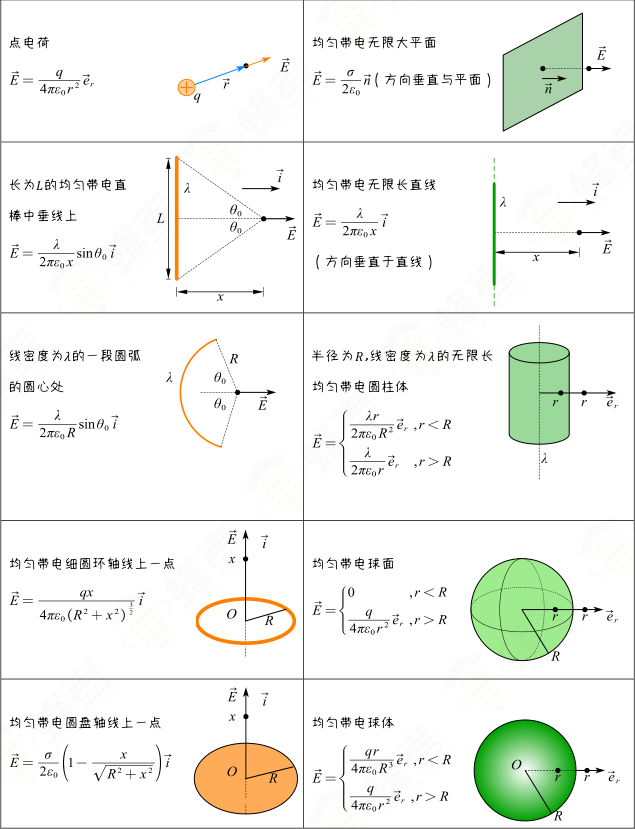
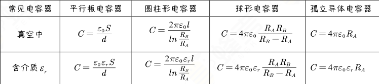
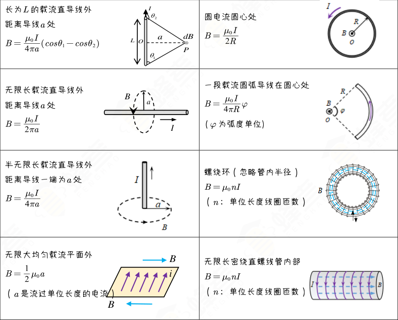

# 大学物理突击复习——电磁学部分

---

## 电场强度

### 求电场强度——离散型

#### 库仑定律： $F=\frac{1}{4\pi\epsilon_0}\cdot\frac{q\cdot q_0}{r^2}$

1. 同性相斥，异性相吸
2. 电场力跟电量 $q,q_0$成正比，跟 $r^2$成反比
3. 真空中介电常量： $\epsilon_0 = 8.85 \times 10^{-12}C^2/N\cdot m^2$

#### 电场强度： $E = \frac{1}{4\pi\epsilon_0}\cdot \frac{q}{r^2}$ (矢量，有大小有方向)

1. $\vec{E}$方向判定：将正电荷放入电场中，受力方向即 $\vec{E}$的方向
2. 电场强度跟场源电荷 $q$和位置 $r$有关，与试探电荷 $q_0$无关

### 求电场强度——连续型

#### 公式如下：

$$
dE = \frac{1}{4\pi\epsilon_0}\cdot\frac{dq}{r^2}
$$

$$
E=\int dE=\int \frac{1}{4\pi\epsilon_0}\cdot\frac{dq}{r^2}
$$

其中

$$
dq=\begin{cases}
\lambda \mathrm{d}l, & \lambda是电荷线密度\\
\sigma \mathrm{d}S, & \sigma是电荷面密度\\
\rho \mathrm{d}V, & \rho是电荷体密度
\end{cases}
$$

通过这三个公式，也可以推出 

$$
\begin{cases}
\lambda = \sigma \mathrm{d}l\\
\sigma = \rho \mathrm{d}S
\end{cases}
$$

对于非一维问题，一般将 $\vec{E}$ 转化为各个方向的分量相加，对各个分量进行积分，最后将各个积分后的结果相加 

### 求电场强度——结论型

#### 一些常见带电体产生的电场强度：

### 求电场强度——特殊方法

#### 补偿法

已知一个半径为 $R_2$ 的均匀带电圆盘，现挖去其以中心为原点半径为 $R_1$ 的圆盘，求剩余圆环在 $P$ 点的电场强度。

查阅上表，可得知：均匀带电圆盘轴线上一点的电场强度 $\vec{E} = \frac{\sigma}{2 \epsilon_0} \left[ 1 - \frac{x}{\sqrt{R^2 + x^2}} \right] \hat{i}$

对于现在的圆盘，可以看作是：电荷密度为 $\sigma$ 的半径为 $R_2$ 的均匀带电圆盘和电荷密度为 $-\sigma$ 的半径为 $R_1$ 的均匀带电圆盘叠加而成

因此有：

$$
\vec{E} = \vec{E}_{\text{R}_2 } + \vec{E} _{\text{R}_1 } = \frac{x \sigma}{2 \epsilon_0} \left[ \frac{1}{\sqrt{R_1^2 + x^2}} - \frac{1}{\sqrt{R_2^2 + x^2}} \right] \hat{i}
$$

#### 极限法

对于上述题目，若题干将有限半径的圆盘改为均匀无限大平板  $(R_1=0,R_2 \to \infty)$

则可推出均匀无限大平板周围空间的场强：

$$
E=\frac{\sigma}{2\epsilon_0}
$$

---

## 电通量、高斯定理

### 电场线几点注意事项：

1. 电场线起自正电荷，终止于负电荷，不会在没有电荷处中断。

2.  电场线不闭合，不相交。

3. 疏密表示场强。 $\left\vert \vec{E} \right\vert = dN/dS_\perp$ 

### 电通量：穿过某一有向曲面的电场线条数  $\Phi_e = \vec{E} \cdot \vec{S}$

1. $E$和 $S$必须是垂直关系
2. 对于曲面，向外穿出为正，向内穿入为负
3. 电通量是标量，有正负之分

| 微元                                                         | 成角                          | 垂直                 |
| ------------------------------------------------------------ | ----------------------------- | -------------------- |
| $d\Phi_e=\vec{E}\cdot d\vec{S}$, $\Phi_e=\iint_S d\Phi_e = \iint_S \vec{E}\cdot d\vec{S}$ | $\Phi_e=E\cdot S \cos \theta$ | $\Phi_e = E \cdot S$ |

其中， $\theta$ 角为 $S$ 法线方向与电场强度 $E$ 的夹角。（规定法线的正方向指向曲面凸侧，而对于闭合曲面，规定法线的正方形指向曲面外侧）

### 真空中静电场的高斯定理

#### 高斯定理的数学表述

$$
\Phi_e = \oiint_S \vec{E} \cdot d\vec{S}=\frac{1}{\epsilon_0}\sum q_{内}
$$

其中，闭合曲面 $S$ 被称为高斯面。

1. 高斯面上的电场强度仍为所有电荷的总电场强度，而对于高斯面的电通量，仅高斯面内的电荷对其有贡献。

2. 通过高斯定理可证明，静电场是有源场，高斯面内的静止电荷是产生静电场的源头，这也揭示了高斯定理的意义。

#### 高斯定理的应用

##### 求解有对称分布特性的电场

1. 分析电场（带电体）对称性，满足对称性时，求解 $\oiint_S \vec{E}\cdot d\vec{S}$ 时，往往能**将 $\left\vert \vec{E} \right\vert$ 提取到积分号外**。
2. 根据对称性选择合适的高斯面（通过所求的点、闭合曲面）
3. 求出通过高斯面的电通量 $\phi_e$，计算高斯面内电荷电量的代数和，然后应用高斯定理求出 $\left\vert \vec{E} \right\vert$ 

注意：对于一些*有限大小*的带电体，即使它们的电场具有对称性，但是无法找到一个高斯面 $S$，使得 $E$可以从积分号内提出，此类问题无法应用高斯定理求解，一般使用微元法进行求解。

##### 求解相对复杂的电场

比较复杂的电场可以看作是各个简单电场的叠加，而简单的对称分布电场可以用高斯定理求解，再使用电场的叠加定理即可求解。

---

## 电势、电势能

### 静电力做功

在任意带电体的电场内，电场力做功只与始末位置有关，与路径无关（环流定理可由此推出）

$$
A_{ab}=\sum_i \frac{q_i q_0}{4 \pi \varepsilon_0} \left( \frac{1}{r_{ai}} - \frac{1}{r_{bi}} \right)
$$

由此可推出静电力是保守力，静电场是保守场

### 电势

静电场的安培环路定理： $\oint_L \vec{E}\cdot d\vec{l}=0$

由此公式可得， $\vec{E}$ 的旋度为零，即静电场为*无旋场*

一般可由此定理判断一个电场是否为静电场

#### 静电场中电势 $u_a=\frac{W_a}{q_0}$ 

1. 电势是标量，有大小正负，无方向
2. 零势能点可以任意选取，不同的零势能点对应的电势不同，而两点的差值与零点的选取无关
3. 电势在数值上等于单位正电荷从该点沿任意路径到零势能点电场力做功

#### 求电势三种类型（无穷远为零势能点）：

1. 离散型： $u=\frac{q}{4\pi\epsilon_0r}$
2. 连续型： $du=\frac{dq}{4\pi\epsilon_0r},u=\int{\frac{dq}{4\pi\epsilon_0r}}$
3. 已知场强求电势： $u_p=\int_{p}^{ \infty}\vec{E}\cdot d\vec{l}$ （通常分段来求）

若圆环、半圆环或者部分圆环，只要求出总带电量 $Q$ ，则在圆心处： $u=\frac{Q}{4\pi\epsilon_0R}$

### 电势能

$$
W_a-W_b=A_{ab}=q_0\int_{a}^{b}\vec{E}\cdot d\vec{l}=-\Delta E_p
$$

$$
W_a=W_{a参考点}=q_0\int_{a}^{参考点}\vec{E}\cdot d\vec{l}
$$

### 等势面（描述电势在空间的分布）

规定：相邻等势面之间的电势差相等（类似于等高线）

1. 沿等势面移动电荷 $q_0$ ，静电力做功为零
1. 等势面与电场线互相垂直       $\vec{E} \perp {等势面}$
1. 等势面越密，电场越强；等势面越疏，电场越弱
1. 两个等势面之间，电势降低的方向与场强方向一致（ $u_{ab}=\int_{a}^{b}\vec{E}\cdot d\vec{l}=u_a-u_b$  ，当 $\vec{E}$ 的方向和 $\vec{l}$ 一致，均由 $a$ 指向 $b$ ，那么此时 $u_{ab}>0,u_a>u_b$ ）

### 电场强度和电势的关系

任意一场点处电场强度大小等于沿过该点等势面法线方向上电势的变化率，负号表示电场强度的方向指向电势降低的方向，用公式描述为：

$$
E=-\frac{\mathrm{d} u}{\mathrm{d} n}
$$

也可以理解为，电场强度在 $l$ 方向上的投影等于电势沿该方向变化率的负值，用公式描述为：

$$
E_l=-\frac{\mathrm{d} u}{\mathrm{d} l}
$$

而在直角坐标系中，分别将 $x,y,z$ 轴作为 $l$ 的方向，则有：

$$
E_x=-\frac{\partial u}{\partial x} \\
E_y=-\frac{\partial u}{\partial y} \\
E_z=-\frac{\partial u}{\partial z}
$$

因此有：

$$
\vec{E}=-(\frac{\partial u}{\partial x} \hat{i}+\frac{\partial u}{\partial y} \hat{j}+\frac{\partial u}{\partial z} \hat{k})=-\nabla (u)
$$

注意： $E=0\nLeftrightarrow u=0,E大小 \nLeftrightarrow u大小$   类比原函数和其导数，原函数的大小无法判断其导数的大小，而 $E$ 的大小取决于 $\frac{\mathrm{d} u}{\mathrm{d} n}$ 的大小，而不是 $u$ 的大小

## 导体

### 静电平衡的基本性质

1. 电荷分布在表面，内部场强处处为零

2. 导体表面电场强度的方向都与导体表面垂直 $E=\frac{\sigma}{\epsilon_0}$

3. 由上述两条性质可推导出导体是等势体，其表面是等势面

###  静电平衡时导体的电荷分布

1. 对于实心带电导体：导体内部无电荷，所有电荷分布在导体的外表面
2. 对于有空腔带电 $(Q)$ 导体
   - 当空腔内无电荷时：电荷仅分布在外表面上（内表面也无电荷）
   - 当空腔内有电荷 $(+q)$ 时：导体内表面会因静电感应而出现等值异号的电荷 $-q$ ，而外表面也会因此有感应电荷 $+q$ ，即外表面总带电量为 $Q+q$ 

### 导体表面的场强

#### 数学表述

1. 导体表面场强的大小与该表面电荷面密度成正比，即：

$$
E=\frac{\sigma}{\epsilon_0}
$$

2. 因此得出以下结论：孤立导体表面电荷分布与该点曲率有关，曲率越大， $\sigma$ 越大， $E$ 越大；而曲率越小， $\sigma$ 越小， $E$ 越小

#### 实际应用

尖端放电现象：通过上述结论可以推出，带电导体尖端附近的电场特别大，以至于可以使尖端附近的空气发生电离而成为导体产生放电现象。（避雷针、静电除尘）

### 静电屏蔽

#### 两种空腔导体

##### 腔内无带电体

1. 内表面处处没有电荷
2. 腔内无电场（电势处处相等）

因此，导体空腔可以屏蔽外电场

##### 腔内有带电体 $(+q)$ 

此时腔内会产生感应电荷 $-q$  ，而此时腔内的电场只与带电体的电量 $q$ 、腔内表面形状、介质有关

#### 静电屏蔽的装置

对于腔内有带电体的空腔导体，当外壳不接地时，外壳也会感应出电荷 $+q$ ，此时此空腔会发出向外的电场线，影响外部电场；若将外壳接地，此时外壳的电量变为零，将不会再影响外部电场

只有当外壳接地时，此空腔导体才是静电屏蔽装置，即*腔内、腔外的场互不影响*

此时腔内场只与内部带电量及内部几何性质和介质有关，而腔外场只有外部带电量和外部几何条件及介质有关

#### 关于导体接地的误区

大地是良好的电中性物体，可以提供大量的正、负电荷给接地的导体

在导体接地后：

1. 导体与大地共电势，即 $u_{导体}=0$
2. 导体电量是唯一确定的状态，*由电势条件决定*
3. 接地后并不意味着导体中的电荷一定流光

### 含导体的静电场分析

1. 静电平衡的条件与性质： $E_内=0,u_{导体}=C$
2. 电荷守恒定律
3. 应用电势和场强的相关公式进行求解

## 电容

### 孤立导体的电容

当导体电势 $u=1V$ 时导体容纳的电荷的量被称为孤立导体的电容。 

$$
C=\frac{Q}{u}
$$

注意：电容描述的是导体的带电能力，与导体是否带电无关，与导体的几何因素和介质有关

### 电容器：彼此绝缘且相距很近的导体组合

#### 电容器的电容

$$
C=\frac{Q}{\Delta u}
$$

和孤立导体的电容类似的，电容器的电容与 $Q $无关，只与两极板间的几何因素和两极板间所充的电介质有关

#### 常用电容器的电容

#### 计算电容器电容的一般方法

1. 设极板带电量为 $Q$
2. 利用已知量求出电容器之间的电场强度 $E$
3. 对电场强度进行路径的线积分求出极板间的电势 $\Delta u$
4. 利用 $C=\frac{Q}{\Delta u}$ 求出电容

#### 电容器的串、并联

* 电容串联：容电能力减弱，耐压能力增强

$$
\frac{1}{C}=\frac{1}{C_1}+\frac{1}{C_2}
$$

* 电容并联：耐压能力不变，容电能力增强

$$
C=C_1+C_2
$$

## 电介质

### 电偶极子：一对等量异号电荷

#### 电偶极矩

$$
\vec{P}_e=q \vec{l}
$$

注意：当观测距离远大于 $l$ 时，才能构成电偶极子系统

#### 在匀强电场的中的特性

1. 受电场力：

$$
\vec{F}=+q \vec{E} + (-q) \vec{E}=0
$$

2. 受力矩：

$$
\vec{M}=\vec{r} \times \vec{F}=2 \times \frac{\vec{l}}{2} \times q \vec{E}=q\vec{l}\times\vec{E}=\vec{P}_e \times\vec{E}
$$

3. 具有电势能：

$$
W=+qu_+-qu_-=q(u_+-u_-)=-qEl cos\theta=-\vec{P}_e \cdot \vec{E}
$$

   其中， $\theta $角为 $\vec{l}$ 与 $\vec{E}$ 的夹角

#### 在非匀强电场的中的特性

类似的有：

$$
\vec{F}=+q \vec{E} + (-q) \vec{E'}≠0 \\
\vec{M}=\vec{P}_e \times\vec{E} \\
W=-\vec{P}_e \cdot \vec{E}
$$

### 电介质对电场的影响

电介质的相对介电常数： $\epsilon_r$

真空中的介电常数： $\epsilon_0=8.85\times10^{-12} \quad C^2 \cdot N^{-1} \cdot m^{-2}$

介质中的介电常数： $\epsilon ≥ \epsilon_0$

介质中的相对介电常数：

$$
\epsilon_r=\frac{\epsilon}{\epsilon_0}≥1
$$

将介质板插入平行板电容器后，其电场强度和电势差的变化：

$$
E=\frac{E_0}{\epsilon_r},u=\frac{u_0}{\epsilon_r}
$$

可见介质中场强和电势差都变小（本质是介质发生极化现象）

### 电介质高斯定理

电介质中场强：  $E=\frac{E_0}{\epsilon_r}$

极化电荷密度：  $\sigma'=(1-\frac{1}{\epsilon_r}\sigma_0)$

#### 电位移矢量

$$
\vec{D}=\epsilon_0\epsilon_r\vec{E}=\epsilon\vec{E}
$$

和电场线类似的，电位移矢量也有 $\vec{D}$ 线，画法和电场线完全相同：始于正自由电荷，终于负自由电荷，不相交，不闭合

$\vec{D}$ 的通量：

$$
\phi_D=\vec{D} \cdot \Delta S \\
\phi_D=\iint\vec{D} \cdot d S
$$

#### 电介质中的高斯定理

通过闭合曲面的电位移通量等于改高斯面所包围的自由电荷的代数和，与极化电荷和高斯面外电荷无关

$$
\oiint{\vec D \cdot d\vec S}=\sum_i q_{0i内}
$$

## 电场的能量

### 电容器的能量

$$
W_e=\frac{1}{2}\frac{Q^2}{C}=\frac{1}{2}CU^2=\frac{1}{2}QU
$$

当电容器电量 $Q$ 保持不变时（电源断开）时，通常使用

$$
W=\frac{Q^2}{2C}
$$

当电容器两极板间电压 $U$ 保持不变（电源保持接通）时，通常使用

$$
W=\frac{1}{2} CU^2
$$

### 电场的能量

忽略边缘效应，对平行板电容器有：

$$
U=Ed,C=\frac{\epsilon S}{d} \\
W=\frac{1}{2} CU^2=\frac{1}{2} \epsilon E^2 Sd=\frac{1}{2} \epsilon E^2 V
$$

这里的V指极板之间的空腔体积，也就是电场线真正存在的空间

可得出结论，带电系统的能量储存于电场中

### 电场能量密度（适用于所有电场）

$$
w=\frac{W}{V}=\frac{1}{2} \epsilon E^2
$$

因此在不均匀电场中，可用电场能量密度来计算此电场的能量：

$$
dW=w dV \\
W=\iiint_V dW=\iiint_V \frac{1}{2} \epsilon E^2 dV
$$

## 磁场

### 磁感应强度—— $B=\frac{F_m}{qv}$

定义： $B=\frac{F_m}{qv}$ 单位： $T$， $1T=10^4Gs$

为矢量，方向由 $F_{max}\times v$确定（右手螺旋）

### 毕奥-萨伐尔定律

#### 电流元

电流可以看做是无穷多段小电流的集合，各段小电流称作电流元，用 $Id\vec{l}$表示。

#### 毕奥-萨伐尔定律

$$
d\vec{B}=\frac{\mu_0}{4\pi} \cdot \frac{Id\vec{l}\times\vec{e_r}}{r^2}
$$

$$
\vec{B}=\frac{\mu_0}{4\pi}\cdot\int\frac{Id\vec{l}\times{\vec{e_r}}}{r^2}
$$

其中真空磁导率： $\mu_0=4\pi\times10^{-7}T\cdot m/A$

大小： $dB=\frac{\mu_0}{4\pi}\cdot\frac{Idl\cdot \sin\alpha}{r^2}$		$B=\frac{\mu_0}{4\pi}\cdot\int\frac{Idl\cdot \sin\alpha}{r^2}$

方向：右手螺旋定则

### 常见磁感应强度

### 磁矩—— $m=ISe_n$

式中， $I$为源电流回路中的电流， $S$为圆电流回路平面的面积， $e_n$为回路平面的法线方向（右手螺旋定则）

如果电流回路为 $N$匝线圈，则载流线圈总的磁矩为

$$
m=NISe_n

$$

### 磁场中的高斯定理

#### 磁通量 $\Phi_m=\int d\Phi_m = \int_S B \cdot dS$

单位：韦伯（Wb）

* $B$和 $S$必须是垂直关系
* 对于曲面，向外穿出为正，向内穿入为负
* 沿闭合曲面积分为零，穿入等于穿出（无源场）

#### 真空中恒定磁场中的高斯定理

$$
\oint_S B \cdot dS = 0
$$

微分形式：

$$
\nabla \cdot B =0
$$

### 安培环路定理

$$
\oint_L B \cdot dl = \mu_0 \sum_i I_i
$$

注意：

* 积分只与环路内的电流有关，与电流位置及环路外电流无关；
* $\sum I_{内}$指的是环路内的净电流，判断正负使用右手法则，同向为正，反向为负；
* 环路上的各点$B$，不仅由环路内电流影响，还由环路外电流影响。

---

## References

[【完整版】《大学物理-电磁学》11小时系统学习|期末拿高分【蜂考】_哔哩哔哩_bilibili](https://www.bilibili.com/video/BV1H4NGerE4X?spm_id_from=333.788.videopod.sections&vd_source=34aca5102e4781db1ca53d6bb100be6e)

[latex 常用数学符号(数值函数、根式、微分与导数、模运算、极限、范围与预测)_latex多元函数极限-CSDN博客](https://blog.csdn.net/qq_45353993/article/details/129109027)
