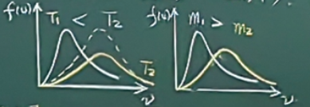

# 热学笔记

## 气体动理论

研究气体热现象的微观理论

### 状态参量，平衡态，准静态过程

#### 气体的状态参量

- **热力学系统：** 由大量围观粒子组成的有限宏观物质系统.

- **外界或环境：** 系统以外的物体.

- **状态参量：** 描述热力学系统的物理量.

压强$P$ .体积$V$ .温度$T$ .（宏观量）

粒子 $m$ . $v$ . $\vec{p}$ . $E$（微观量）

#### 平衡态

**平衡态：** 大量粒子组成的系统不受外界影响时，其宏观量具有稳定值的状态.

**非平衡态：** 系统各种性质不稳定的状态.

***热力学第零定律*** 如果两个热力学系统中的每一个都与第三个系统处于热平衡，那么这两个系统也处于热平衡.

*处于热平衡的两个系统，具有共同的性质：温度 $T$ .测温*.

**温标：** 温度的数值表示法

*摄氏温标*

标准气压下，冰水混合物 $0\degree C$ ，水的沸点 $100\degree C$ ，测温物质：Hg
$$
t(\degree C)=\frac{V -V_0}{V_100-V_0} \times 100 (\degree C)
$$
*热力学温标（开尔文温标）*

参考点：绝对零度 $T(K)=t(\degree C)-273.15$ 或水的三相点$phase.T=273.16K$ 

#### 准静态过程

**准静态过程：** 热力学过程中，任一中间状态都可看成是平衡态.

若过程中只要存在一个非平衡态，称为非静态过程.

$(P.V.T)$ 独立的2个， $P-V$ . $P-T$ . $V-T$ .平衡态.

### 理想气体的状态方程

#### 玻意耳 - 马略定律

$$
PV=C
$$

温度不太低，压强不太大时成立

*满足玻-马定律的气体：理想气体*

#### 查理定律

$$
P/T=C
$$

质量一定

#### 盖 - 吕萨克定律

$$
V/T=C
$$

#### 理想气体的状态方程

$$
pV=\frac{m}{M}RT
$$

#### 阿伏伽德罗定律

$p\to 0$ . $T$ . $P$ 相同，$1mol$ 任何气体体积相同
$$
pV/T=R=8.314J/(mol\cdot K)
$$

标准状况下，$1mol$ 任何气体体积为 $22.4L$

### 理想气体的压强

**思想：**建立压强与微观量的关系，导出压强公式

**建模：**

1. 分子作无规则的热运动；
2. 分子大小可忽略，看成质点；
3. 分子间除碰撞外，无力的作用；
4. 分子间，分子与器壁间为弹性碰撞；
5. 忽略重力。

$$
p=\frac{1}{3}nm\overline{v^2}=\frac{2}{3}n\overline{\varepsilon_t}
$$

**讨论：**

1. 压强是大量分子统计的结果，对单个分子，谈不上压强；
2. 压强是相对平衡态而言的；
3. 给相互压强的微观本质；
4. 给出温度的本质。

### 理想气体的温度

$$
p=nkT\\
\overline{\varepsilon_t}=\frac{3}{2}kT
$$

其中玻尔兹曼常数 $k=1.38\times 10^{-23}J/k$

**讨论：**

1. 温度具有统计意义，对单分子不适用；
2. 温度针对平衡态而言；
3. 分子平均平动动能的度量。

### 麦克斯韦速率分布律

总粒子数 $N$，速度 $v_x,v_y,v_z$，平衡态，无规则的热运动

麦克斯韦速率分布：在平衡状态下，理想气体分子速率在 $v \sim v+ \mathrm{d} v$区间内的分子数占总分子数的百分比为
$$
\frac{dN}{N_0} = 4\pi \left( \frac{m_0}{2\pi kT} \right)^{\frac{3}{2}} e^{-\frac{m_0 v^2}{2kT}} v^2 dv
$$
麦克斯韦速率分布函数为：
$$
f(v) = 4\pi \left( \frac{m_0}{2\pi kT} \right)^{\frac{3}{2}} e^{-\frac{\mu v^2}{2kT}} v^2
$$
表示 $v$附近单位速率间隔分子数占总分子书的百分比。

**讨论：**

1. $f(v)$偏正态分布，$v \to 0,\infty,f(v)\to 0$ 在中间某区域，分子数最大；
2. 曲线 $v \sim v+\mathrm{d}v$ 区域窄条面积 $f(v)\mathrm{d}v=\frac{\mathrm{d}N_0}{N}$. 速率 $v \sim v+\mathrm{d}v$ 概率，$\int_{v_1}^{v_2} f(v) dv$ 概率；
3. 只可给出某一速率区间的分子数，谈论速度为某一确定值的分子数无意义；
4. 速率分布可以给出三种速率 $\sqrt{\overline{v^2}} > \overline{v} > v_{\text{p}}$
5. 从 $v_p$表达式看出，$m$一定，$T \uparrow$. $T$一定，$m \uparrow$.

- 最概然速率 $v_{p} = \sqrt{\frac{2RT}{m}} = \sqrt{\frac{2RT}{M}} = 1.41\sqrt{\frac{RT}{M}} = 1.41\sqrt{\frac{kT}{m}}$
- 平均速率 $\overline{v}=\sqrt{\frac{8RT}{\pi M}} = 1.60\sqrt{\frac{RT}{M}}$
- 方均根速率 $\sqrt{\overline{v^2}} = \sqrt{\frac{3kT}{m}} = 1.73\sqrt{\frac{kT}{m}} = 1.73\sqrt{\frac{RT}{M}} = \sqrt{\frac{3RT}{M}}$

